<!-- wysee:page-break -->
<!-- wysee:slug home -->
# Introduction

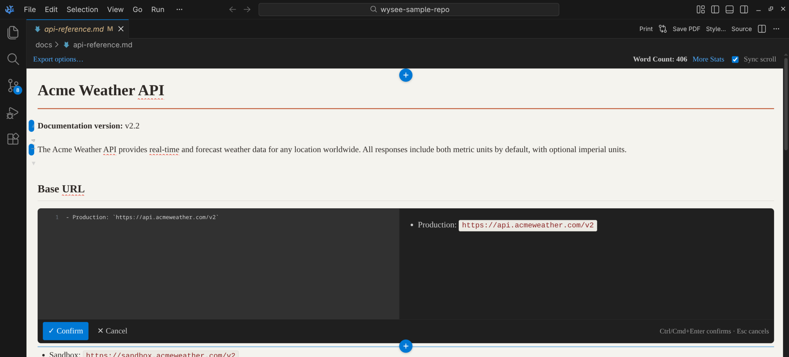{width=100%, align=center}

Wysee Markdown is a visual Markdown editor for VS Code and VSCodium.

It keeps Markdown as the source of truth, but gives you a better working surface: a rendered canvas for reading and structure, inline raw Markdown editing when precision matters, rendered diffs for real review, and export tools for the moment the document needs to leave the editor.

Wysee is built for people who write documentation, reports, technical notes, review bundles, and Markdown that eventually needs to be printed, approved, or shared with people who do not care about Markdown syntax.

## Start here

A good first path through the docs is:

1. Read [Installation](#installation) and [Quick Start](#quick-start)
2. Learn [Edit a block](#edit-a-block) and [Insert new content](#insert-new-content)
3. Review [What rendered diff is for](#what-rendered-diff-is-for)
4. Choose an export path in [Choose the right output](#choose-the-right-output)
5. Set up [Configure AI](#configure-ai) only if you need review summaries

## What makes Wysee different

Most Markdown tooling treats the document as raw text first and rendered output second. Wysee flips that balance without replacing Markdown itself.

With Wysee, you can:

- read the document as a document
- edit precise source where it matters
- review changes in rendered form
- generate outputs that are ready for printing or approval
- keep using normal Markdown files on disk

That is the main pitch: **better authoring and better review without inventing a new file format**.

## Where Wysee shines

Wysee is especially strong when you need one or more of these workflows:

- visually author and restructure long Markdown documents
- compare document revisions in a human-readable way
- export PDFs or print-ready pages
- package changes for approval or stakeholder review
- keep style and output consistent without leaving VS Code

## How the workflow fits together

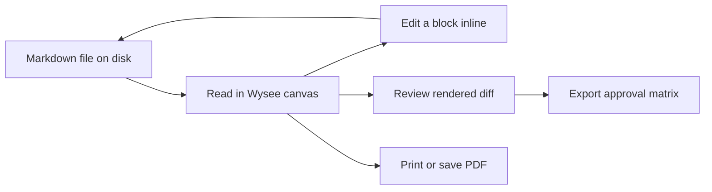

## What Wysee is not

Wysee is not a proprietary document format, and it is not a general-purpose page layout tool. The point is not to stop using Markdown. The point is to make Markdown authoring, review, and export feel less primitive.

If you prefer raw source editing for a particular document, you can still open the same file in the regular text editor.

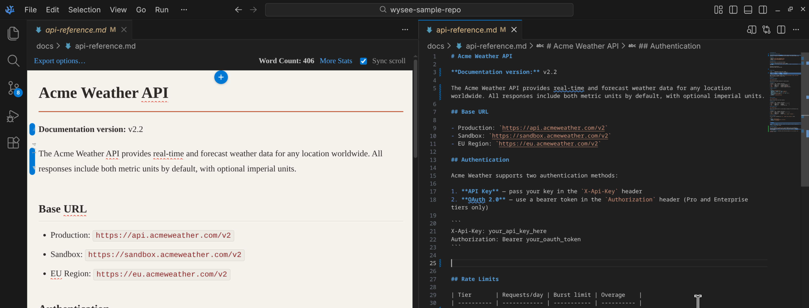{width=100%, align=center}

Or if you prefer, you can change your default Markdown editor back to `Text Editor` at any time in VSCode's settings.

<!-- wysee:page-break -->

<!-- wysee:slug getting-started -->
# Getting Started

The fastest way to understand Wysee is to open a real Markdown file and use it for five minutes.

## Requirements

Wysee is intended for desktop VS Code and VSCodium environments.

Supported:

- VS Code 1.90+ or VSCodium equivalent
- local desktop usage

Not supported:

- VS Code for the Web
- Codespaces
- remote hosts

If your workflow depends on browser-only or remote-only editing, use the normal text editor or a different tool for those environments.

## Installation

Install Wysee from one of the supported extension registries:

- [VS Code Marketplace](https://marketplace.visualstudio.com/items?itemName=grainpool.wysee-md)
- [Open VSX](https://open-vsx.org/extension/grainpool/wysee-md)

If you compile from source, you can also install from VSIX:

```bash
code --install-extension wysee-md-0.11.0.vsix
```

Or with VSCodium:

```bash
codium --install-extension wysee-md-0.11.0.vsix
```

## Quick Start

Open any `.md` file. In a standard desktop setup, Wysee opens it in the canvas by default.

Once the document is open:

1. Double-click a block to edit its raw Markdown
2. Click `(+)` between blocks to insert new content
3. Right-click for the insert menu
4. Open **Export options…** in the toolbar
5. Toggle sync scroll if you want the canvas and source editor to move together

That sequence is enough to understand the core product model.

## Your first five minutes

A practical first-run checklist:

1. Open a Markdown document that already has a few headings and lists
2. Edit one paragraph in place
3. Insert a new heading between two blocks
4. Paste in an image from the clipboard
5. Open print preview
6. Open the rendered diff for the working tree

Do not start with custom themes or AI config. Start by proving the base authoring loop feels good.

## Opening the normal text editor

Wysee does not lock you into one editor.

To open the same file in the default text editor, use **Open With...** and choose **Text Editor**.

That means a healthy workflow can look like this:

- use Wysee for structure, review, and export
- use the standard editor for uninterrupted source editing
- move between them as the document demands

You can **easily** switch between views whenever you want:

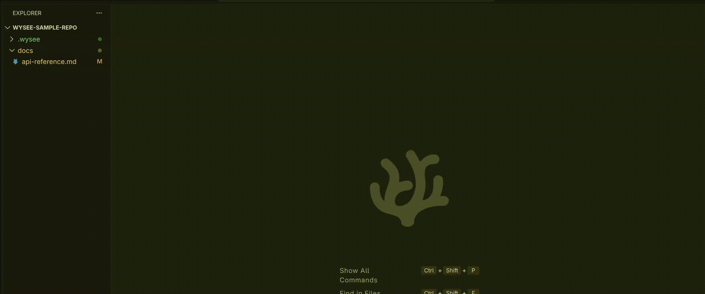{width=100%, align=center}


## Core ideas to keep in your head

The rest of the docs will make more sense if you keep these ideas in mind:

- the file on disk is still Markdown
- the canvas is the main reading surface
- blocks are the unit of editing
- rendered diff is about meaning, not only line changes
- export is part of the writing workflow, not an afterthought

---

<!-- wysee:page-break -->

<!-- wysee:slug visual-editing -->
# Visual Editing

Wysee’s editing model is simple: **read in rendered form, edit in real Markdown, stay close to the final document the whole time**.

## The canvas is for reading and structure

The canvas is not just a preview pane. It is the primary reading surface.

Use it when you want to:

- understand the shape of the document
- navigate large sections visually
- reason about layout, spacing, and hierarchy
- see code, tables, diagrams, and footnotes in context

This matters because many Markdown files stop being pleasant to read in raw form long before they stop being pleasant to read as documents.

## Edit a block

Double-click any block to open its raw Markdown in the inline editor.

This is the core interaction in Wysee. It gives you the best part of both worlds:

- you retain the document context around the block
- you still edit actual Markdown, not a proprietary rich-text model

This is especially useful for paragraphs, lists, links, callouts, and fenced content where you want precision without losing visual orientation.

## Insert new content

Use the `(+)` controls between blocks when you are adding structure to an existing document.

That is often faster and safer than manually carving out space in raw source, especially in long documents.

A good rule of thumb:

- use `(+)` when you know where a new block belongs
- use inline editing when you know exactly how the block should be written

## Use the context menu for structured insertion

Right-click in the canvas to insert common Markdown structures without building them by hand.

Typical insertions include:

- headings from H1 through H6
- links
- images
- tables
- code fences
- mermaid fences
- task lists
- footnotes
- horizontal rules

This is one of the reasons Wysee feels like an authoring tool instead of just a source editor with a preview attached.

## Formatting shortcuts

The inline editor supports familiar shortcuts for common inline markup:

| Action | Shortcut |
| --- | --- |
| Bold | `Ctrl+B` |
| Italic | `Ctrl+I` |
| Insert link | `Ctrl+K` |
| Find | `Ctrl+F` |

On macOS, standard editor conventions may use `Cmd` in place of `Ctrl`.

These shortcuts matter because they reduce friction during routine editing. You should not have to think about punctuation every time you want emphasis or a link.

## Find in document

Use find when you are updating a long document and need to move quickly without losing the visual context.

Search is more important in a rendered editor than it first appears. It lets you treat the document as a navigable artifact rather than as a flat text buffer.

## Paste images from the clipboard

If you paste an image from the clipboard, Wysee can save it as a PNG and insert the Markdown reference.

That is ideal for:

- screenshots
- issue reports
- bug reproductions
- technical documentation with quick UI callouts

It removes one of the most annoying steps in normal Markdown authoring.

## Tables, spellcheck, stats, and scroll sync

Several “small” features make a big difference once the novelty wears off:

- **tables** are easier when you insert the structure first and edit the contents second
- **spellcheck** catches avoidable mistakes while you draft
- **More Stats** helps with word count, reading time, character counts, code lines, and dangling reference detection
- **scroll sync** keeps the canvas and the source editor aligned


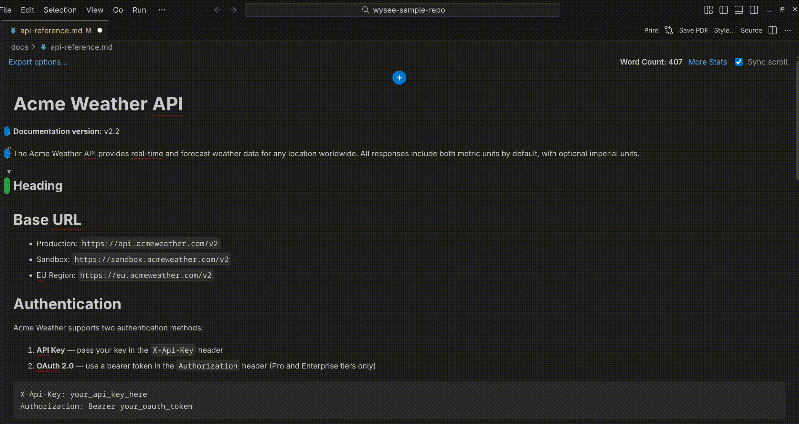{width=100%, align=center}

---

These are not flashy features, but they greatly improve authoring workflows.

---

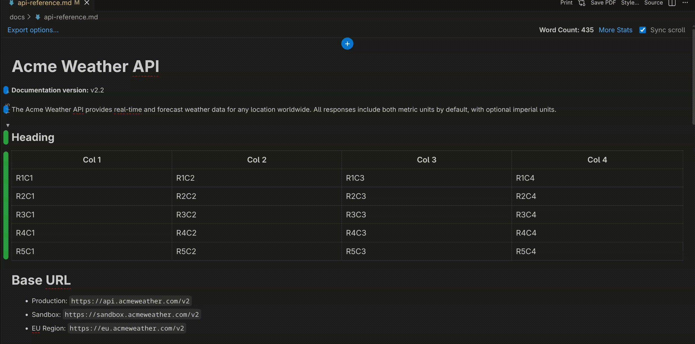{width=100%, align=center}


## The editing mindset that works best

Wysee works best when you stop thinking “I am editing text” and start thinking “I am shaping a document.”

That does not mean the Markdown details stop mattering. It means they stop being the only thing you can see.

---

<!-- wysee:page-break -->

<!-- wysee:slug rendered-diff -->
# Rendered Diff and Review

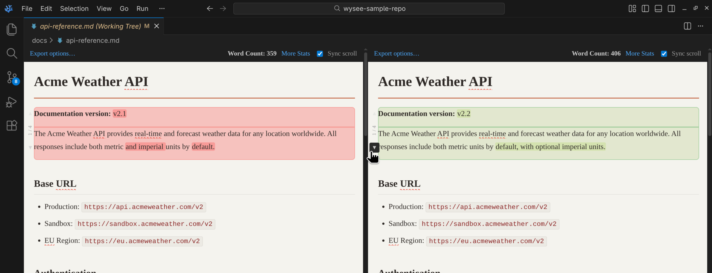{width=100%, align=center}

Rendered diff is one of Wysee’s defining ideas.

The point is not to replace source diff. The point is to review changes in a way that better matches how readers, reviewers, and approvers understand documents.

## What rendered diff is for

Use rendered diff when the important question is not “which line changed?” but “what changed in the document?”

Rendered diff is especially useful for:

- prose-heavy documentation
- revisions to headings and structure
- changes to lists and tables
- stakeholder-facing wording
- review packages that need sign-off

Raw source diff still has a place. Rendered diff is simply better when meaning matters more than punctuation.

## Start with the working tree

For everyday use, start with the working tree diff.

That gives you the quickest answer to:

- what changed since I last saved or committed?
- is this document ready for review?
- did I introduce a structural problem while editing?

Most of the time, this is the right first pass.

## Read the visual language of the diff

Rendered diff helps because it gives you more than line additions and deletions.

Look for:

- changed block backgrounds
- inline word-level highlights
- placeholders where structure moved or disappeared
- synchronized scroll between the before and after sides

The aim is to make the document changes legible at document scale.

---

{width=100%, align=center}

---

## Gutter indicators and hunk navigation

The regular editor view can show diff gutter indicators so you can scan a file quickly and jump where the action is.

Once you open the full review, hunk navigation helps you stay systematic:

1. review one hunk
2. understand the intent
3. move on
4. keep going until the change set feels coherent

This is much more reliable than casual scrolling.

## When to prefer rendered diff over raw diff

Prefer rendered diff when a change affects:

- heading hierarchy
- wording
- layout or flow
- list semantics
- table meaning
- reader comprehension

Prefer raw diff when a change is tiny, mechanical, or mostly about Markdown punctuation.

The two views are complementary. Use the one that makes the question easier.

---

<!-- wysee:page-break -->

<!-- wysee:slug printpdf -->
# Print and PDF Exports

A lot of Markdown tooling stops too early. The document exists, but the work is not done.

Wysee treats output as part of the workflow.

## Choose the right output

Different outputs exist for different jobs.

| Output | Best for | Typical audience |
| --- | --- | --- |
| Print | Triggering a paper-ready output | You, internal reviewers |
| Save PDF | Direct artifact generation | Stakeholders, records, handoff |
| Approval Matrix | Structured review workflow | Approvers, reviewers, sign-off owners |

A good rule:

- use **Print** to actually print a document
- use **Save PDF** when you need to save the file
- use **Approval Matrix** when someone must review changes systematically

## Print first, style second

Before you spend time on design polish, open print preview and look for structural problems:

- awkward page breaks
- giant tables
- unreadable code blocks
- heading or spacing issues
- pagination that feels sloppy

If the document does not print well with a basic style, it probably needs structural cleanup before it needs more design.

## Save PDF

**Save PDF…** uses a local Chromium installation for direct PDF output.

Use it when you need:

- a file to circulate
- something archival
- a clean handoff artifact
- a repeatable export path that does not depend on a live print dialog

If PDF export is unavailable, verify the local Chromium requirement first, then fall back to browser print if you need immediate output.

## Page breaks, margins, and page numbers

When the output matters, layout settings matter more than people think.

Wysee supports print-oriented controls such as:

- page size
- margins
- mirror margins
- page numbers
- code wrapping
- print profiles

Use an explicit page break only when you know a hard boundary matters.

Example:

```markdown
<!-- wysee:page-break -->
```

Use page breaks intentionally. They should express a publishing choice, not hide structural problems.

---

<!-- wysee:page-break -->

<!-- wysee:slug approval -->

# Approval Matrix

The Approval Matrix is Wysee Markdown's defining feature. It turns a Markdown diff into a structured, row-by-row review workbook — with rendered before-and-after images, clickable review links, AI-generated summaries, and a self-contained HTML companion — all exported as a single ZIP bundle.

Most diff tools show you what changed. The Approval Matrix makes you *decide* about each change.


## When to use it

The Approval Matrix belongs anywhere a change needs sign-off, not just reading:

- **Regulated documents** — SOPs, compliance policies, financial disclosures where every edit must be traced and approved individually
- **API documentation reviews** — contract changes, deprecation notices, and breaking-change announcements that need explicit stakeholder acknowledgment
- **Multi-reviewer workflows** — when different people own different sections and each needs to approve only their hunks
- **Audit trails** — when you need a timestamped, self-contained record that a specific set of changes was reviewed against a specific pair of revisions
- **Client-facing deliverables** — when a plain "track changes" PDF isn't rigorous enough, or when the reviewer isn't technical enough for a Git diff

If your document lives in Git and someone other than the author needs to approve changes, the Approval Matrix is the right tool.

## The export bundle

The export produces a ZIP file containing two artifacts that work together:

### The workbook (XLSX)

Each detected change hunk becomes one row. The columns are:

| Column | Contents |
|--------|----------|
| **A — Change #** | Sequential identifier (e.g., `DOC-001`) |
| **B — Document Path** | Breadcrumb showing where in the document this change lives, with heading ancestry preserved |
| **C — Summary of change** | AI-generated summary (when enabled) or placeholder for manual entry |
| **D — Previous Version** | Rendered card image showing the content *before* the change, with deletion highlighting |
| **E — Change** | Rendered card image showing the content *after* the change, with addition highlighting |
| **F — Link to Doc** | Clickable hyperlink that opens the review HTML and scrolls directly to this hunk |
| **G — Approval** | Dropdown with configurable statuses: *Pending*, *Approved*, *Needs changes*, *Not applicable* |
| **H — Comments** | Free-text column for reviewer notes |


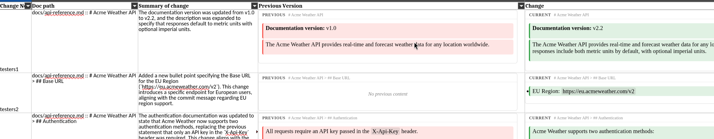

The workbook also contains a hidden metadata sheet with 28 columns of traceability data: block IDs, line spans, context bundles, Git revision hashes, touching commit history, and image dimensions. This metadata is invisible during normal review but available for automated processing or audit queries.

### The review HTML

A standalone, self-contained HTML file that renders the full side-by-side diff — no extension, no VS Code, no dependencies. Open it in any browser.

Each hunk in the workbook has a clickable link in column F that opens this HTML and scrolls directly to the corresponding change. The review HTML provides the full rendered context that the card images can only approximate: surrounding paragraphs, table structure, code blocks with syntax highlighting, and synchronized scroll between the previous and current versions.

{width=100%, align=center}


## Starting an export

Open a Markdown file in Wysee and click **Export options…** in the bottom bar, then choose **Export Approval Matrix**. You can also run the command directly: **Wysee: Export Approval Matrix**.

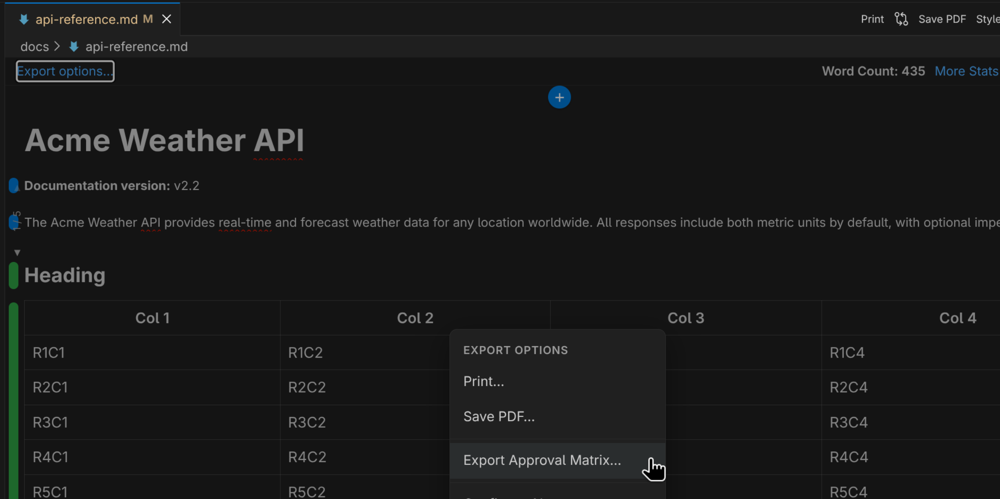

### Step 1: Choose the comparison

The first dialog asks what you want to compare. The options depend on your context:

**Working tree diff** (one click) — compares the last commit against your current saved file. This is the most common choice during active editing.

**Select a commit** (two clicks) — picks a starting commit from your recent Git history, then asks what to compare it against: your current file, HEAD, or another commit. Use this for release reviews or comparing across multiple commits.

**Enter revisions manually** — paste two commit hashes separated by a comma. Use this when the commits you need aren't in the recent history list.

**Open diff pair** — when you already have a side-by-side diff open (from `code --diff` or the Git changes panel), Wysee detects it and uses those two documents directly. No revision selection needed.

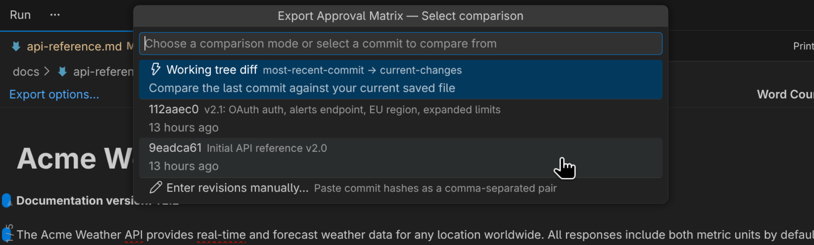

### Step 2: Set the review link URL

After choosing the comparison, an input box asks for the **publish URL** — the future location where the review HTML will be hosted. This URL becomes the base for every clickable "Open review" link in column F of the workbook.

- If you'll host the review HTML on a shared drive or web server, enter the full URL (e.g., `https://reviews.example.com/docs/api-review.html`). Each 'diff hunk' link will append `#hunk-0001`, `#hunk-0002`, etc.
- If the review HTML will sit in the same folder as the workbook, **leave it blank**. The links will use relative paths that work when both files are unzipped together. This is the preferred method for 'email portability'.
- If you set a default in VS Code settings (`wysee.approvalMatrix.publishUrl`), it pre-fills here so you can just press Enter.

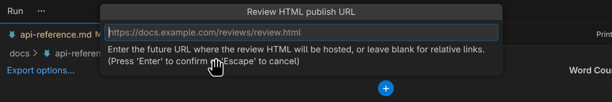{width=100%, align=center}

### Step 3: Set the bundle's save location

A standard save dialog appears. The default filename includes the document name and a timestamp. The bundle exports as a single `.zip` file.

During export, a progress notification shows each stage: capturing hunk card images, generating AI summaries (with a running count like "Generating AI summaries (3/12)…"), building the workbook, and packaging the bundle.

If AI is enabled, the progress notification gains a **Cancel** button. Clicking it stops generation and asks whether to **Discard** the entire export or **Export with existing summaries** (keeping whatever the AI finished before cancellation and filling the rest with placeholders).

### Step 4: Choose AI summaries (optional)

If you've configured an AI model, a second dialog appears offering your available models. Pick one, or choose **Continue without AI** to leave column C empty for manual annotation.

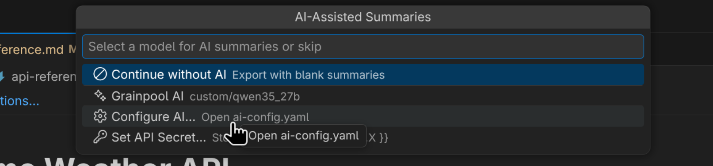{width=100%, align=center}

## The complete flow

The export speed depends on the number of diffs between your selected commits. The spreadsheet, images, summaries, and html artifacts can be generated ***in mere moments***:

{width=100%, align=center}

And yes, the exported artifact is WYSIWYG too:

{width=100%, align=center}

---

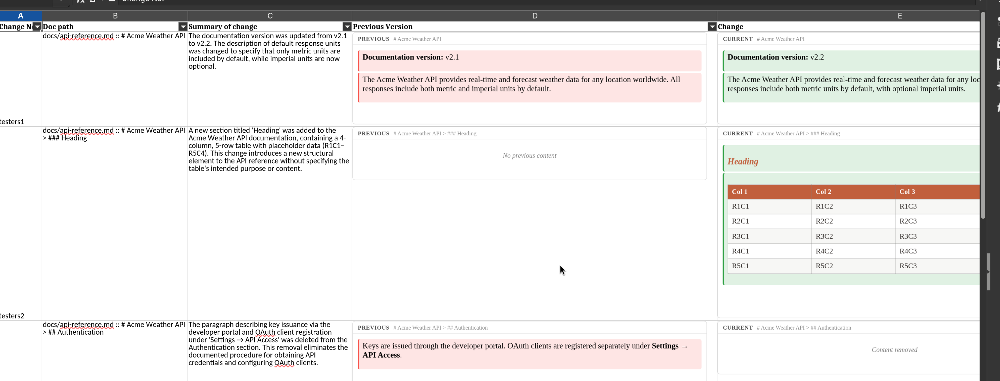{width=100%, align=center}

---

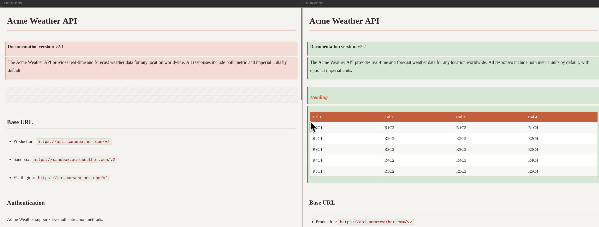{width=100%, align=center}

**Note:** Factors like your computer's processing speed, the export's size, and your chosen AI service can all affect the speed of the export process.


## Review workflow guidance

A good Approval Matrix workflow looks like this:

### 1. Prepare the document

Finish your edits. Save. If you're working with Git, commit when you're ready for the review baseline — or compare against working-tree changes if you want to review before committing.

### 2. Self-review with the rendered diff

Before exporting, look at the rendered diff yourself. Wysee's side-by-side diff view shows exactly what reviewers will see. Catch obvious issues now.

### 3. Export the approval bundle

Run the export. Choose your comparison range and AI model. The bundle lands as a ZIP wherever you saved it.

### 4. Distribute

Unzip the bundle and share both files:

- Send the **workbook** to reviewers who need to formally approve or reject changes
- Send the **review HTML** alongside it — reviewers click the links in column F to see full context

The review HTML is fully self-contained. No server, no login, no extension. It works offline, in any browser, on any operating system.

### 5. Collect decisions

Each reviewer fills in their approval status and comments in the workbook. The dropdown in column G gives consistent options: *Pending*, *Approved*, *Needs changes*, *Not applicable*. Column H captures free-text feedback.

Because every hunk is a separate row, you can track partial approval — "sections 1–4 approved, section 5 needs changes" — without ambiguity.

### 6. Revise and re-export

Address feedback. Re-export if needed. The new bundle reflects the current state. Over time, the workbook versions form a traceable review history.

<!-- wysee:page-break -->

<!-- wysee:slug export -->

# AI-assisted summaries in the approval matrix

When enabled, AI summaries populate column C of the workbook with concise, reviewer-facing descriptions of each change. The summaries are grounded in real document context — not just raw text. This context packet is intelligently assembled by Wysee in a token-conscious manner automatically, and can further be configured by you.

Each prompt sent to the model includes:

- **Heading ancestry** — the full section path with Markdown markers preserved (e.g., `# API Reference > ## Authentication`)
- **Framing context** — table headers, code fence language, list lead-ins, and other structural cues that explain *what kind of content* changed
- **Git revision metadata** — commit messages and tags for the selected comparison range, when available
- **Per-hunk commit provenance** — the specific commits that touched this region of the document, ordered oldest to newest
- **Raw Markdown excerpts** — the actual before and after content, in Markdown (not stripped plain text)

The model responds with a structured JSON contract. The `summary` field populates the workbook. The response also includes `user_visible`, `context_limited`, and `reviewer_flags` fields reserved for future use.

## Configuring AI

Open the configuration panel via the command palette: **Wysee: AI Config: Settings**.

The panel provides form fields for everything: model connection details, authentication, request scheduling, prompting templates, context settings, and output behavior. A collapsible raw YAML editor at the bottom is bidirectionally synced with the form — edit either one and the other updates. Field-level validation highlights errors in red as you type.

See **Wysee: AI Config: Preview Prompt** to inspect a sample of the exact system and user messages the model receives before running an export.

## Scheduling and cancellation

Each model can be configured as **sequential** (one request at a time, safest for local models) or **parallel** (bounded concurrency up to 12, faster for hosted APIs). Cancellation during generation aborts in-flight requests immediately and offers **Discard** or **Export with existing summaries**.

AI failure never blocks export. A hunk whose summary fails gets a `[summary]` placeholder. The workbook and review HTML are always produced.

## Configuration

### Approval statuses

The dropdown values in column G default to *Pending*, *Approved*, *Needs changes*, and *Not applicable*. Customize them according to your change control needs using the VS Code/Codium extension settings:

```json
"wysee.approvalMatrix.approvalStatuses": [
  "Pending",
  "Approved",
  "Approved with comments",
  "Rejected",
  "Deferred"
]
```

### Card dimensions

The rendered card images in columns D and E default to 720px wide. Adjust with:

```json
"wysee.approvalMatrix.cardWidth": 960,
"wysee.approvalMatrix.cardMaxHeight": 1200
```

### Hidden columns

If your workflow doesn't need screenshots or AI summaries, hide them:

```json
"wysee.approvalMatrix.hiddenColumns": ["screenshots", "summary"]
```

Available column keys: `summary`, `screenshots`, `link`, `approval`, `comments`.

### Publish URL

Set a base URL so the review links in column F point to a hosted copy of the review HTML:

```json
"wysee.approvalMatrix.publishUrl": "https://reviews.example.com/docs/"
```

Without this, links use relative paths that work when the HTML sits next to the workbook.


<!-- wysee:page-break -->

<!-- wysee:slug ai-summaries -->
# AI Summary Philosophy

Wysee’s AI features are deliberately narrow.

AI exists to summarize changes for the approval workflow. It does not define the editor, and it does not block export when it fails.

That is the right boundary.

## What AI is for

Use AI summaries when you want to give reviewers fast context for a change set.

That is especially useful when:

- the review package is large
- the reviewer is not living inside Git
- the audience wants a concise summary rather than a raw diff
- the workbook needs to stand on its own

Do not think of AI as part of the core editing experience. It is a helper for change review.

## When to skip AI

Skip AI when:

- the changes are trivial
- you need maximum determinism
- the audience already knows the context
- you do not want to manage model access or credentials
- the workbook is useful even without summaries

A clean export without AI is still a successful workflow.

## Configure AI

Create `.wysee/ai-config.yaml` in your workspace root.

```yaml
models:
  - name: Qwen3-Coder 30B
    provider: ollama
    model: qwen3-coder:30b
    endpoint: http://localhost:11434/v1
    auth: none
    options:
      temperature: 0.3
      maxTokens: 512

  - name: GPT-4o Mini
    provider: openai
    model: gpt-4o-mini
    endpoint: https://api.openai.com/v1
    auth: bearer
    apiKey: ${{ secrets.OPENAI_API_KEY }}

activeModel: "Qwen3-Coder 30B"

prompting:
  template: default-review-summary
```

## Supported providers

Wysee works with OpenAI-compatible endpoints, which means you can use:

- hosted APIs
- local models through Ollama
- local models through LM Studio
- other compatible endpoints that expose the same general API shape

That flexibility matters because different teams have different privacy, speed, and cost requirements.

## Store secrets separately

Use the command palette to store secrets instead of hardcoding them directly into shared config when possible.

That keeps workspace config easier to share and less risky to commit accidentally.

## Keep model behavior boring

For approval workflows, boring output is good output.

Prefer:

- lower temperature
- short summaries
- predictable wording
- models that are reliable more than expressive

This is not a creative writing feature. It is a review convenience.

## Failure handling

When exporting an approval matrix, Wysee lets you choose a model or continue without AI.

That is exactly how it should behave.

If AI fails:

1. check the endpoint
2. check auth
3. check the model name
4. check the YAML format
5. retry with a simpler, known-good model
6. continue export without AI if needed

The document workflow matters more than making the AI work perfectly.

---

<!-- wysee:page-break -->

<!-- wysee:slug styling -->

# Styling and Themes
 
Wysee separates document appearance from code appearance and from print layout. That is the right design, because those are related but different concerns.
 
## Document styles
 
Document styles control the rendered appearance of the content itself — typography, spacing, heading rhythm, blockquote feel, table appearance, and overall reading tone.
 
Use them when you want to shape things like:
 
- typography and font family
- spacing and line height
- heading hierarchy and rhythm
- blockquote and callout feel
- table structure and striping
- overall reading tone
 
A good default path is:
 
1. start with **Match Editor Theme** — it inherits your VS Code theme's colors and fonts automatically
2. switch to **Light** or **Dark** if you want a stable baseline that doesn't change with your editor theme
3. move to custom JSON styles only when you have a specific problem to solve
 
 
### JSON structure
 
A document style is a JSON file with CSS declaration lists for each element type:
 
```json
{
  "id": "my-style",
  "name": "My Custom Style",
  "syntaxStyle": "my-syntax",
  "baseStyles": "font-family: Georgia, serif; font-size: 16px; line-height: 1.7; color: #333; background: #fff;",
  "elementStyles": {
    "h1": "font-size: 2em; font-weight: 700; border-bottom: 1px solid #eee;",
    "p": "margin: 0 0 1em 0;",
    "a": "color: #0366d6; text-decoration: underline;"
  }
}
```
 
**Required fields:**
 
| Field | Type | Description |
|---|---|---|
| `id` | string | Unique identifier. Must not start with `__` (reserved for built-ins). Use lowercase with hyphens: `my-style`, `company-report`. |
| `name` | string | Display name shown in the style picker. |
 
**Optional fields:**
 
| Field | Type | Description |
|---|---|---|
| `baseStyles` | string | CSS declarations applied to the document root. Sets the foundation: font family, size, line height, text color, background. |
| `elementStyles` | object | CSS declarations for specific Markdown element types. Keys are element identifiers (see below). Values are semicolon-separated CSS declaration lists — no selectors, no braces, no `@` rules. |
| `syntaxStyle` | string | ID of a syntax style to pair with this document style. When set, code blocks use that syntax style's colors regardless of the active syntax style in the dropdown. |
 
 
### Element style keys
 
Each key maps to one or more CSS selectors. You write declaration lists only.
 
**Text elements:**
 
| Key | Targets | Typical properties |
|---|---|---|
| `p` | Paragraphs | `margin`, `line-height`, `text-indent` |
| `h1` — `h6` | Headings 1–6 | `font-size`, `font-weight`, `margin`, `border-bottom`, `color` |
| `blockquote` | Block quotes | `border-left`, `padding-left`, `margin`, `color`, `font-style` |
| `hr` | Horizontal rules | `border`, `margin`, `height`, `background` |
| `a` | Links | `color`, `text-decoration` |
| `img` | Images | `max-width`, `height`, `border-radius`, `box-shadow` |
 
**List elements:**
 
| Key | Targets | Typical properties |
|---|---|---|
| `ul` | Unordered lists | `list-style-type`, `padding-left`, `margin` |
| `ol` | Ordered lists | `list-style-type`, `padding-left`, `margin` |
| `li` | List items | `margin-bottom`, `line-height` |
 
**Table elements:**
 
| Key | Targets | Typical properties |
|---|---|---|
| `table` | Table container | `width`, `border-collapse`, `margin`, `font-size` |
| `thead` | Table head section | `background`, `font-weight` |
| `tbody` | Table body section | `background` |
| `th` | Header cells | `font-weight`, `text-align`, `padding`, `border-bottom`, `background` |
| `td` | Data cells | `padding`, `border-bottom`, `vertical-align` |
| `tableHeaderRow` | First row (header) | `background`, `border-bottom` |
| `tableOddRow` | Odd body rows (1st, 3rd…) | `background` |
| `tableEvenRow` | Even body rows (2nd, 4th…) | `background` |
| `tableOddColumnCell` | Cells in odd columns | `background`, `text-align` |
| `tableEvenColumnCell` | Cells in even columns | `background`, `text-align` |
 
**Code elements:**
 
| Key | Targets | Typical properties |
|---|---|---|
| `codeInline` | Inline code (`` `text` ``) — not code inside fenced blocks | `font-family`, `font-size`, `background`, `color`, `padding`, `border-radius` |
| `codeBlock` | Code text inside fenced blocks (the `<code>` inside `<pre>`) | `font-family`, `font-size`, `color` |
| `pre` | Fenced code block container (the `<pre>` wrapper) | `background`, `padding`, `border-radius`, `overflow-x`, `margin` |
 
**Special elements:**
 
| Key | Targets | Typical properties |
|---|---|---|
| `taskCheckbox` | Task list checkboxes | `margin-right`, `transform`, `accent-color` |
| `mermaid` | Mermaid diagram containers | `display`, `overflow-x`, `text-align`, `margin` |
 
 
### Built-in document styles
 
**Match Editor Theme** (`__match-editor`) — inherits colors and fonts from your VS Code/VSCodium theme via CSS variables like `var(--vscode-editor-foreground)`. Looks correct in any theme. Default on installation.
 
**Light** (`__light`) — explicit light colors: white background, dark text (#24292e), GitHub-inspired styling. Good for print output.
 
**Dark** (`__dark`) — explicit dark colors: dark background (#0d1117), light text (#c9d1d9), GitHub Dark-inspired styling.
 
 
### Document style examples
 
**Serif academic style:**
 
```json
{
  "id": "academic",
  "name": "Academic",
  "baseStyles": "font-family: 'Palatino Linotype', 'Book Antiqua', Palatino, serif; font-size: 12pt; line-height: 1.8; color: #1a1a1a; background: #fefefe;",
  "elementStyles": {
    "p": "margin: 0 0 0.8em 0; text-indent: 1.5em;",
    "h1": "font-size: 1.8em; font-weight: 700; text-align: center; margin: 1.5em 0 0.8em 0;",
    "h2": "font-size: 1.4em; font-weight: 700; margin: 1.2em 0 0.5em 0;",
    "h3": "font-size: 1.15em; font-weight: 600; font-style: italic; margin: 1em 0 0.4em 0;",
    "blockquote": "border-left: 2px solid #999; padding-left: 1.2em; color: #444; font-style: italic;",
    "a": "color: #2c5282;",
    "table": "width: 100%; border-collapse: collapse; margin: 1.5em 0; font-size: 0.95em;",
    "th": "font-weight: 700; border-bottom: 2px solid #333; padding: 0.5em;",
    "td": "border-bottom: 1px solid #ddd; padding: 0.5em;",
    "codeInline": "font-family: 'Courier New', monospace; font-size: 0.9em; background: #f0f0f0; padding: 0.1em 0.3em; border-radius: 3px;",
    "pre": "background: #f5f5f5; padding: 1em; border-radius: 4px; font-size: 0.9em;",
    "hr": "border: none; border-top: 1px solid #ccc; margin: 2em 0;"
  }
}
```
 
**Minimal dark style:**
 
```json
{
  "id": "minimal-dark",
  "name": "Minimal Dark",
  "baseStyles": "font-family: 'Inter', system-ui, sans-serif; font-size: 15px; line-height: 1.65; color: #e0e0e0; background: #1e1e1e;",
  "elementStyles": {
    "p": "margin: 0 0 1em 0;",
    "h1": "font-size: 1.75em; font-weight: 600; color: #fff; margin: 1.5em 0 0.5em 0;",
    "h2": "font-size: 1.35em; font-weight: 600; color: #fff; margin: 1em 0 0.4em 0;",
    "blockquote": "border-left: 3px solid #555; padding-left: 1em; color: #aaa;",
    "a": "color: #6cb6ff;",
    "codeInline": "font-family: 'JetBrains Mono', 'Fira Code', monospace; background: rgba(255,255,255,.08); color: #e0e0e0; padding: 0.15em 0.3em; border-radius: 4px;",
    "codeBlock": "font-family: 'JetBrains Mono', 'Fira Code', monospace; color: #e0e0e0;",
    "pre": "background: #161616; padding: 1em; border-radius: 6px;",
    "table": "width: 100%; border-collapse: collapse;",
    "th": "font-weight: 600; border-bottom: 1px solid #444; padding: 0.4em 0.6em;",
    "td": "border-bottom: 1px solid #2a2a2a; padding: 0.4em 0.6em;",
    "tableOddRow": "background: rgba(255,255,255,.03);"
  }
}
```
 
 
---
 
## Syntax styles
 
Code blocks often need their own treatment. Syntax styles control how code is colored by mapping highlight.js token categories to CSS declarations, with support for per-language overrides and the ability to disable highlighting for specific languages.
 
That separation keeps the document readable without forcing one theme to do every job.
 
Use them to control:
 
- token coloring across all languages
- language-specific readability overrides
- the balance between document tone and code clarity
- disabling highlighting for languages that don't benefit from it
 
 
### JSON structure
 
```json
{
  "id": "my-syntax",
  "name": "My Syntax Theme",
  "syntaxStyles": {
    "default": {
      "keyword": "color: #c678dd;",
      "string": "color: #98c379;",
      "comment": "color: #5c6370; font-style: italic;",
      "number": "color: #d19a66;",
      "function": "color: #61aeee;",
      "type": "color: #e5c07b;",
      "variable": "color: #e06c75;"
    },
    "python": {
      "keyword": "color: #ff79c6;",
      "string": "color: #f1fa8c;"
    },
    "sql": {
      "keyword": "color: #569cd6; font-weight: 600;"
    }
  }
}
```
 
**Required fields:**
 
| Field | Type | Description |
|---|---|---|
| `id` | string | Unique identifier. Must not start with `__` (reserved for built-ins). Use lowercase with hyphens. |
| `name` | string | Display name shown in the syntax style picker. |
| `syntaxStyles` | object | Token style definitions. Must contain at least a `default` key. |
 
The `syntaxStyles` object contains one or more language keys. The `default` key defines base token colors that apply to all languages. Additional keys (matching highlight.js language identifiers like `python`, `sql`, `javascript`) override specific tokens for that language only. Per-language objects only need to include the tokens you want to override — anything not listed falls back to the `default` definition.
 
 
### Disabling highlighting
 
Add `"highlight": false` to disable syntax highlighting:
 
**Globally** (no code blocks get colored):
 
```json
"syntaxStyles": {
  "default": {
    "highlight": false,
    "keyword": "color: #c678dd;"
  }
}
```
 
**Per-language** (only that language loses coloring):
 
```json
"syntaxStyles": {
  "default": {
    "keyword": "color: #c678dd;",
    "string": "color: #98c379;"
  },
  "python": { "highlight": false }
}
```
 
When `highlight` is `false` on `default`, the extension returns empty CSS and skips highlight.js processing entirely. When `highlight` is `false` on a specific language, highlight.js still runs (so the HTML structure is preserved) but all token colors are neutralized to `inherit`.
 
 
### Token keys
 
Each key maps to one or more highlight.js CSS classes. You write CSS declaration lists — `color`, `font-style`, `font-weight`, `background`, etc.
 
**Core tokens:**
 
| Key | What it colors | Example languages |
|---|---|---|
| `keyword` | Language keywords: `if`, `else`, `return`, `class`, `import`, `def` | All |
| `builtIn` | Built-in names: `print`, `len`, `console`, `parseInt` | Python, JS, Ruby |
| `type` | Type names: `int`, `String`, `boolean`, `float` | Java, C, TypeScript |
| `literal` | Literal values: `true`, `false`, `null`, `None`, `nil` | All |
| `string` | String literals: `"hello"`, `'world'`, template strings | All |
| `regexp` | Regular expressions: `/pattern/g` | JS, Ruby, Perl |
| `number` | Numeric literals: `42`, `3.14`, `0xFF`, `1_000` | All |
| `variable` | Variables: `$name`, `@field`, `self` | PHP, Ruby, Rust |
| `operator` | Operators: `=`, `+`, `-`, `==`, `=>`, `&&` | All |
| `punctuation` | Punctuation: brackets, parentheses, semicolons, commas | All |
| `comment` | Comments: `// ...`, `/* ... */`, `# ...` | All |
| `doctag` | Documentation tags: `@param`, `@return`, `@throws` | Java, JSDoc, PHPDoc |
 
**Structure tokens:**
 
| Key | What it colors | Example languages |
|---|---|---|
| `function` | Function names at their definition site | Python, JS, C |
| `title` | Class names, section headings, titles (general) | Java, Markdown |
| `titleClass` | Class names specifically (higher specificity than `title`) | Java, TypeScript, Python |
| `params` | Function parameters in definitions | Python, JS, Ruby |
| `property` | Object properties and CSS properties | JS, CSS, JSON |
 
**Markup / HTML / CSS tokens:**
 
| Key | What it colors | Example languages |
|---|---|---|
| `attr` | HTML/XML attribute names: `class`, `href`, `id` | HTML, XML, JSX |
| `attribute` | CSS property names and attribute values | CSS, SCSS |
| `selector` | CSS selectors: `#id`, `.class` | CSS, SCSS, Less |
| `selectorAttr` | CSS attribute selectors: `[type="text"]` | CSS, SCSS |
| `selectorPseudo` | CSS pseudo selectors: `:hover`, `::before` | CSS, SCSS |
| `tag` | HTML/XML tag names: `div`, `span`, `body` | HTML, XML, JSX |
| `name` | Names in various contexts | XML, YAML |
 
**Meta / special tokens:**
 
| Key | What it colors | Example languages |
|---|---|---|
| `meta` | Preprocessor directives, metadata: `#include`, `@use` | C, SCSS |
| `symbol` | Symbols and special literals: `:symbol`, atoms | Ruby, Elixir, Clojure |
| `subst` | Template literal substitutions: `${...}` | JS, Python f-strings |
| `charEscape` | Escape sequences in strings: `\n`, `\t`, `\x00` | All |
| `bullet` | List markers in markup | Markdown |
| `link` | URLs and links | Markdown |
| `code` | Code spans in markup | Markdown |
| `formula` | Math formulas in markup | Markdown, LaTeX |
 
**Variable subtypes:**
 
| Key | What it colors | Example languages |
|---|---|---|
| `variableLanguage` | Language-reserved variables: `this`, `self`, `super` | JS, Python, Ruby |
| `variableConstant` | Constants: `ALL_CAPS` identifiers | All |
 
**Diff tokens:**
 
| Key | What it colors | Example languages |
|---|---|---|
| `addition` | Added lines in diffs (`+`) | Diff |
| `deletion` | Removed lines in diffs (`-`) | Diff |
 
**Text style tokens:**
 
| Key | What it colors | Example languages |
|---|---|---|
| `emphasis` | Italic/emphasized text | Markdown |
| `strong` | Bold/strong text | Markdown |
 
 
### Linking syntax styles to document styles
 
A document style can specify which syntax style to use via the `syntaxStyle` field:
 
```json
{
  "id": "my-doc-style",
  "name": "My Document Style",
  "syntaxStyle": "my-syntax",
  "baseStyles": "...",
  "elementStyles": { ... }
}
```
 
When a document style has a `syntaxStyle` field, that syntax style is used for code blocks regardless of what's selected in the syntax style dropdown. If the linked syntax style doesn't exist, it falls back to the active syntax style. This works the same way `printStyle` links a print profile to a specific document style.
 
 
### Built-in syntax styles
 
**Match Editor Theme** (`__match-editor-syntax`) — uses VS Code CSS variables (`var(--vscode-symbolIcon-keywordForeground)`, etc.) so token colors adapt to whatever theme is active. Default on installation.
 
**Light** (`__light-syntax`) — GitHub-inspired light theme: red keywords, purple functions, blue types, dark blue strings, gray comments.
 
**Dark** (`__dark-syntax`) — One Dark-inspired theme: purple keywords, green strings, orange numbers, blue functions, gray italic comments.
 
 
### Syntax style examples
 
**Dracula-inspired:**
 
```json
{
  "id": "dracula",
  "name": "Dracula",
  "syntaxStyles": {
    "default": {
      "keyword": "color: #ff79c6;",
      "string": "color: #f1fa8c;",
      "comment": "color: #6272a4; font-style: italic;",
      "number": "color: #bd93f9;",
      "function": "color: #50fa7b;",
      "type": "color: #8be9fd; font-style: italic;",
      "variable": "color: #f8f8f2;",
      "attr": "color: #50fa7b;",
      "tag": "color: #ff79c6;",
      "literal": "color: #bd93f9;",
      "regexp": "color: #f1fa8c;",
      "meta": "color: #f8f8f2;",
      "addition": "color: #50fa7b; background: rgba(80,250,123,.1);",
      "deletion": "color: #ff5555; background: rgba(255,85,85,.1);"
    }
  }
}
```
 
**Minimal with per-language overrides:**
 
```json
{
  "id": "minimal-custom",
  "name": "Minimal with Overrides",
  "syntaxStyles": {
    "default": {
      "keyword": "color: #0550ae; font-weight: 600;",
      "string": "color: #0a3069;",
      "comment": "color: #8c959f; font-style: italic;",
      "number": "color: #0550ae;",
      "function": "color: #8250df;"
    },
    "python": {
      "keyword": "color: #cf222e;",
      "builtIn": "color: #8250df;",
      "string": "color: #0a3069;"
    },
    "sql": {
      "keyword": "color: #0550ae; font-weight: 700; text-transform: uppercase;",
      "string": "color: #0a3069;",
      "number": "color: #0550ae;",
      "comment": "color: #57606a;"
    },
    "css": { "highlight": false }
  }
}
```
 
 
---
 
## Print profiles
 
Print profiles are where output becomes intentional. They control page layout for print and PDF output — page size, margins, page numbers, and content formatting rules.
 
Think of print profiles as reusable publishing presets. They help you avoid re-deciding the same settings every time.
 
Use them to control:
 
- page size and orientation
- margins (including mirror margins for two-sided printing)
- page numbers (style, position, first-page suppression)
- code block wrapping
- image alignment and maximum width
- the linked document style used for print output
 
 
### JSON structure
 
```json
{
  "id": "my-print",
  "name": "My Print Style",
  "printStyle": "__light",
  "format": "Letter",
  "landscape": false,
  "marginTop": "0.75in",
  "marginRight": "0.75in",
  "marginBottom": "0.75in",
  "marginLeft": "0.75in",
  "mirrorMargins": false,
  "codeBlocks": { "wrap": true },
  "images": { "defaultAlign": "center", "maxWidth": "100%" },
  "pageNumbers": {
    "enabled": true,
    "style": "decimal",
    "position": "center",
    "startAt": 1,
    "suppressFirstPage": true
  }
}
```
 
**Required fields:**
 
| Field | Type | Description |
|---|---|---|
| `id` | string | Unique identifier. Must not be `__default-pdf` (reserved). Use lowercase with hyphens. |
| `name` | string | Display name shown in the profile picker. |
| `format` | string | Page size: `Letter`, `Legal`, `A4`, `A5`, `Tabloid`, or `Custom`. |
| `landscape` | boolean | `true` for landscape, `false` for portrait. |
| `marginTop` | string | Top margin. Any CSS length: `0.75in`, `20mm`, `2cm`, `72pt`. |
| `marginRight` | string | Right margin (or outer margin if `mirrorMargins` is on). |
| `marginBottom` | string | Bottom margin. |
| `marginLeft` | string | Left margin (or inner/binding margin if `mirrorMargins` is on). |
 
**Optional fields:**
 
| Field | Type | Default | Description |
|---|---|---|---|
| `printStyle` | string | *(active style)* | ID of a document style to use for print output. When set, print uses that style's fonts and colors regardless of the active canvas style. Example: `"__light"`. |
| `width` | string | *(from format)* | Custom page width. Only used when `format` is `"Custom"`. |
| `height` | string | *(from format)* | Custom page height. Only used when `format` is `"Custom"`. |
| `mirrorMargins` | boolean | `false` | Swap left/right margins on alternating pages for two-sided printing. Left margin becomes the binding margin. |
| `codeBlocks.wrap` | boolean | `true` | Wrap long lines in fenced code blocks. Keep `true` for print — horizontal scrolling doesn't work on paper. |
| `images.defaultAlign` | string | `"center"` | Default alignment for images without an explicit `{align=...}` attribute: `"left"`, `"center"`, or `"right"`. |
| `images.maxWidth` | string | `"100%"` | Maximum width for all images: `"100%"`, `"80%"`, `"600px"`. |
 
**Page numbers** (all optional, disabled by default):
 
| Field | Type | Default | Description |
|---|---|---|---|
| `pageNumbers.enabled` | boolean | `false` | Show page numbers in print output. |
| `pageNumbers.style` | string | `"decimal"` | Numbering style: `"decimal"` (1, 2, 3), `"i"` (i, ii, iii), `"I"` (I, II, III), `"a"` (a, b, c), `"A"` (A, B, C). |
| `pageNumbers.position` | string | `"right"` | Horizontal position: `"left"`, `"center"`, `"right"`. |
| `pageNumbers.startAt` | number | `1` | First page number. Accepted in JSON but not yet supported by any browser — see compatibility notes. |
| `pageNumbers.suppressFirstPage` | boolean | `false` | Hide the page number on the first page (e.g., for a title page). |
 
 
### Page sizes
 
| Format | Portrait | Landscape |
|---|---|---|
| `Letter` | 8.5 × 11 in | 11 × 8.5 in |
| `Legal` | 8.5 × 14 in | 14 × 8.5 in |
| `A4` | 210 × 297 mm | 297 × 210 mm |
| `A5` | 148 × 210 mm | 210 × 148 mm |
| `Tabloid` | 11 × 17 in | 17 × 11 in |
| `Custom` | Set `width` and `height` | Set `width` and `height` |
 
`Tabloid` is mapped internally to the CSS `ledger` keyword because the CSS `@page size` specification does not include `tabloid` as a named size.
 
 
### Print directives browser compatibility 
 
Print output is generated by opening a styled HTML bundle in the browser and triggering the native print dialog. Different browsers implement different parts of the CSS Paged Media spec.
 
| Feature | Chrome / Edge | Firefox | Safari (macOS) |
|---|---|---|---|
| Page size, orientation, margins | ✅ | ✅ | ✅ |
| `mirrorMargins` | ✅ | ❌ | ✅ (18.2+) |
| Code wrapping, image formatting | ✅ | ✅ | ✅ |
| `pageNumbers` (all fields) | ✅ (131+) | ❌ | ❌ |
| `pageNumbers.startAt` | ❌ | ❌ | ❌ |
 
**Chrome / Edge 131+** is the recommended browser for print. It supports everything except `startAt`.
 
**Firefox** supports page setup, code wrapping, and image formatting. It does not support `mirrorMargins` (`@page :left` / `@page :right`) or any page number features (no CSS page margin boxes).
 
**Safari macOS 18.2+** supports page setup and mirror margins. No page number support.
 
Browsers may add their own headers and footers (page URL, date, page count). Disable them in the browser's print dialog for clean output.
 
 
### Built-in print profiles
 
**Default PDF** (`__default-pdf`) — Letter, portrait, 0.75in margins. No page numbers. Code wrapping on. Cannot be modified.
 
**Example Letter** (`__example-letter`) — Letter, portrait, 0.75in margins, page numbers at bottom-center (decimal, first page suppressed).
 
**Example A4** (`__example-a4`) — A4, portrait, 20mm margins, page numbers at bottom-right (decimal, first page suppressed).
 
 
### Print profile examples
 
**Two-sided book layout:**
 
```json
{
  "id": "book-layout",
  "name": "Book Layout",
  "printStyle": "__light",
  "format": "A5",
  "landscape": false,
  "marginTop": "20mm",
  "marginRight": "15mm",
  "marginBottom": "20mm",
  "marginLeft": "25mm",
  "mirrorMargins": true,
  "codeBlocks": { "wrap": true },
  "images": { "defaultAlign": "center", "maxWidth": "90%" },
  "pageNumbers": {
    "enabled": true,
    "style": "decimal",
    "position": "center",
    "startAt": 1,
    "suppressFirstPage": true
  }
}
```
 
**Roman-numbered legal document:**
 
```json
{
  "id": "legal-roman",
  "name": "Legal (Roman Numerals)",
  "format": "Legal",
  "landscape": false,
  "marginTop": "1in",
  "marginRight": "1in",
  "marginBottom": "1.25in",
  "marginLeft": "1.5in",
  "codeBlocks": { "wrap": true },
  "pageNumbers": {
    "enabled": true,
    "style": "I",
    "position": "center",
    "suppressFirstPage": false
  }
}
```
 
**Wide presentation handout:**
 
```json
{
  "id": "handout-wide",
  "name": "Wide Handout",
  "format": "Custom",
  "width": "11in",
  "height": "8.5in",
  "landscape": true,
  "marginTop": "0.5in",
  "marginRight": "0.75in",
  "marginBottom": "0.5in",
  "marginLeft": "0.75in",
  "printStyle": "__dark",
  "images": { "maxWidth": "60%" },
  "pageNumbers": { "enabled": false }
}
```
 
 
### Print directives
 
In addition to print profiles, you can use comment directives in your Markdown to control page breaks:
 
```markdown
<!-- wysee:page-break -->
<!-- wysee:page-break-before -->
<!-- wysee:page-break-after -->
```
 
These are respected in print/PDF output but do not affect the canvas view. Page break directives work in all browsers.
 
 
---
 
## Use the style panel as a working surface
 
The style panel matters because it gives you live feedback while you tune document, syntax, and print styles.
 
A reliable order of operations:
 
1. get the content structure right
2. choose a document style
3. tune syntax styling if code readability matters
4. select or create a print profile
5. validate with print preview or PDF
 
Do not start by endlessly tweaking styles for a document that still has structural problems. 
 
## When custom styles are worth it
 
Custom style JSON is worth the effort when you can name the problem clearly.
 
Good reasons:
 
- headings feel too dense
- code blocks need stronger separation
- tables are too weak in print
- footnotes need clearer spacing
- review documents need a cleaner reading rhythm
- need to generate an approval matrix that matches the look and feel of the docs
 
Bad reasons:
 
- touching every knob because it exists
- using style to compensate for weak structure
 
 
## Storage locations
 
All three style types use the same pattern: a global directory (available across all workspaces) and an optional workspace directory (scoped to one project). Workspace entries override global entries with the same `id`.
 
**Global directories** (inside `~/.vscode/globalStorage/grainpool.wysee-md/`):
 
| Type | Directory |
|---|---|
| Document styles | `styles/*.json` |
| Print profiles | `print-profiles/*.json` |
| Syntax styles | `syntax-styles/*.json` |
 
**Workspace directories** (inside `.vscode/wysee-md/` in your workspace root):
 
| Type | Directory |
|---|---|
| Document styles | `styles/*.json` |
| Print profiles | `print-profiles/*.json` |
| Syntax styles | `syntax-styles/*.json` |
 
 
## Settings
 
| Setting | Default | Description |
|---|---|---|
| `wyseeMd.style.active` | `__match-editor` | Active document style. Managed via the Style panel dropdown. |
| `wyseeMd.syntaxStyle.active` | `__match-editor-syntax` | Active syntax style. Managed via the Style panel dropdown. |
| `wyseeMd.printProfile.active` | `__default-pdf` | Active print profile. Managed via the Style panel dropdown. |
| `wyseeMd.preview.syntaxHighlight` | `true` | Master on/off switch for all syntax highlighting. When `false`, no code blocks get colored regardless of syntax style. |

<!-- wysee:page-break -->

<!-- wysee:slug supported-markdown -->
# Supported Markdown
 
Wysee supports the Markdown you need for real documentation work, not just the smallest possible subset. Everything renders in the canvas, in print, and in exported HTML.
 
 
## Core syntax
 
Wysee renders **CommonMark** with **GFM extensions** (tables, strikethrough, task lists, autolinks) plus several additions for technical documentation.
 
### Headings
 
```markdown
# Heading 1
## Heading 2
### Heading 3
#### Heading 4
##### Heading 5
###### Heading 6
```
 
All six levels are supported. Each heading becomes a navigable anchor in the rendered diff, the approval matrix review HTML, and the document outline used by AI context.
 
### Paragraphs and inline formatting
 
```markdown
Regular paragraph text with **bold**, *italic*, ~~strikethrough~~,
and `inline code` formatting.
 
[Links](https://example.com) and [reference-style links][ref] work as expected.
 
[ref]: https://example.com
```
 
Autolinks are enabled — bare URLs like `https://example.com` become clickable without explicit link syntax.
 
### Blockquotes
 
```markdown
> This is a blockquote.
>
> It can span multiple paragraphs and contain other Markdown
> elements including **bold**, lists, and code.
```
 
### Horizontal rules
 
```markdown
---
```
 
 
## Lists
 
### Ordered and unordered
 
```markdown
- First item
- Second item
  - Nested item
  - Another nested item
- Third item
 
1. First step
2. Second step
   1. Sub-step A
   2. Sub-step B
3. Third step
```
 
Nested lists are supported to arbitrary depth. Ordered lists preserve custom start numbers.
 
### Task lists
 
```markdown
- [x] Draft the page structure
- [x] Review rendered diff
- [ ] Finalize the print profile
- [ ] Export approval matrix
```
 
Checkboxes render as interactive elements in the canvas. In print and export, they render as checked or unchecked indicators.
 
 
## Tables
 
```markdown
| Feature       | Status    | Notes                     |
|---------------|-----------|---------------------------|
| Mermaid       | Supported | Renders as interactive SVG |
| KaTeX         | Supported | Inline and block math      |
| Approval Matrix | Supported | ZIP bundle export        |
```
 
Tables support alignment via the colon syntax in the separator row:
 
```markdown
| Left-aligned | Centered | Right-aligned |
|:-------------|:--------:|--------------:|
| text         | text     | text          |
```
 
Document styles can target table elements individually — header rows, odd/even body rows, and odd/even column cells all have separate style keys.
 
 
## Code
 
### Fenced code blocks
 
````markdown
```typescript
function greet(name: string): string {
  return `Hello, ${name}`;
}
```
````
 
Fenced blocks support syntax highlighting via highlight.js for 190+ languages. The language identifier after the opening fence (e.g., `typescript`, `python`, `sql`) controls which highlighting grammar is used.
 
Syntax colors are controlled by syntax styles, which are independent of document styles. You can have dark code blocks in a light document, per-language overrides, or disable highlighting for specific languages. See the [Styling and Themes](styling-and-themes.md) page for details.
 
### Inline code
 
```markdown
Use the `--verbose` flag to enable debug output.
```
 
Inline code has its own style key (`codeInline`) separate from fenced blocks, so you can give it different background colors, fonts, or padding.
 
 
## Images
 
```markdown


```
 
### Image attributes
 
Wysee extends standard image syntax with an attribute block for sizing and alignment:
 
```markdown
{width=80%, align=center}
{width=32px, align=left}
{width=100%}
```
 
Supported attributes:
 
| Attribute | Values | Description |
|-----------|--------|-------------|
| `width` | Any CSS length: `80%`, `600px`, `50vw` | Sets both `width` and `max-width` on the image |
| `align` | `left`, `center`, `right` | Horizontal alignment of the image |
 
Attributes are written inside `{}` immediately after the closing `)` of the image URL, with no space between them.
 
### Image paste
 
Ctrl+V with a clipboard image saves the PNG to the workspace and inserts the Markdown reference automatically.
 
 
## Mermaid diagrams
 
````markdown
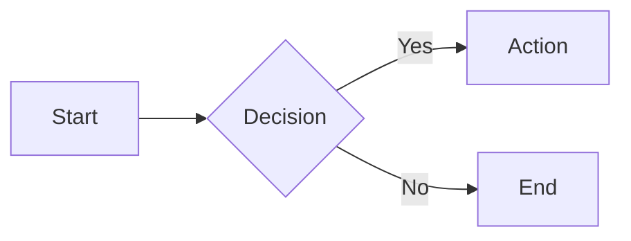
````
 
Mermaid blocks render as interactive SVG diagrams in the canvas, print, and export. Any diagram type that Mermaid.js supports works: flowcharts, sequence diagrams, class diagrams, state diagrams, ER diagrams, Gantt charts, pie charts, and more.
 


 
 
## KaTeX math
 
### Inline math
 
```markdown
The quadratic formula is $x = \frac{-b \pm \sqrt{b^2 - 4ac}}{2a}$ for any quadratic equation.
```
 
### Block math
 
```markdown
$$
\int_{-\infty}^{\infty} e^{-x^2} dx = \sqrt{\pi}
$$
```
 
Math expressions are preprocessed before Markdown rendering and hydrated client-side via KaTeX. Both inline `$...$` and block `$$...$$` delimiters are supported. Math inside code spans and fenced code blocks is left untouched.
 
 
## Footnotes
 
```markdown
The approval matrix[^1] produces a ZIP bundle with two artifacts.
 
The review HTML[^2] is fully self-contained.
 
[^1]: See the Approval Matrix documentation for the full workflow.
[^2]: No server, extension, or login required. Works offline in any browser.
```
 
Footnote references render as superscript numbers. Footnote definitions collect into a numbered section at the bottom of the document. Editing a footnote reference opens the definition for editing alongside it.
 
Footnotes are a custom implementation — not the markdown-it-footnote plugin — which gives Wysee control over the editing experience and the rendered output format.
 
 
## Strikethrough
 
```markdown
~~This text is struck through.~~
```
 
Renders with a line-through decoration. Works in the canvas, print, and export.
 
 
## HTML
 
```markdown
<details>
<summary>Click to expand</summary>
 
This content is hidden by default.
 
- It supports **Markdown** inside HTML blocks
- Including lists, links, and formatting
 
</details>
```

<details>
<summary>Click to expand</summary>
 
This content is hidden by default.
 
- It supports **Markdown** inside HTML blocks
- Including lists, links, and formatting
 
</details>

Raw HTML is passed through to the rendered output when using the browser, but often rendered improperly within VSCode/Codium. This includes `<details>`/`<summary>`, `<div>` wrappers, `<br>` tags, and any other valid HTML. HTML block rendering should be verified in the canvas and in print prior to distribution.
 
Use this sparingly — the point of Markdown is to avoid writing HTML.
 
 
## Print directives
 
```markdown
<!-- wysee:page-break -->
<!-- wysee:page-break-before -->
<!-- wysee:page-break-after -->
```
 
These HTML comments are recognized by Wysee and converted to CSS page-break rules in print and PDF output. They do not render visibly in the canvas (a faint dashed line indicator appears in the editor to show where they are).
 
| Directive | Effect |
|-----------|--------|
| `<!-- wysee:page-break -->` | Forces a page break after this point |
| `<!-- wysee:page-break-before -->` | Forces a page break before the next element |
| `<!-- wysee:page-break-after -->` | Forces a page break after the preceding element |
 
Page break directives work in all browsers.
 
 
## What is not supported
 
Wysee focuses on documentation-grade Markdown. Some things are intentionally outside scope:
 
- **Embedded JavaScript** — script tags are sanitized out
- **Custom containers / admonitions** — no `:::` fence syntax (use blockquotes or HTML `<details>` instead)
- **YAML front matter** — not parsed or rendered (treated as regular content)
- **Wiki-style links** — `[[page]]` syntax is not recognized
- **Abbreviations** — the `*[abbr]: definition` syntax is not supported
- **Definition lists** — the `term : definition` syntax is not supported
- **Image links with spaces** — something like `{width=100%, align=center}` is not supported
 
If you need a feature that isn't listed here, consider whether raw HTML can fill the gap. If it can't, it's probably outside what Wysee is designed to do.
