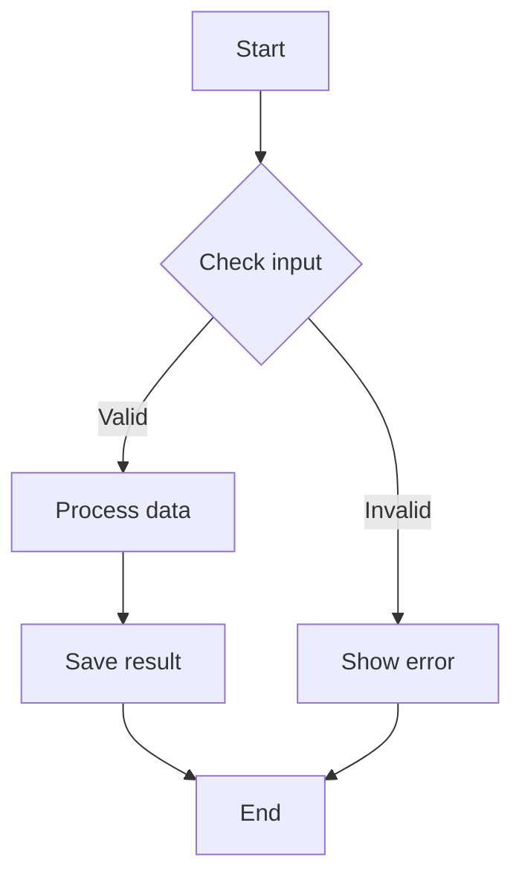
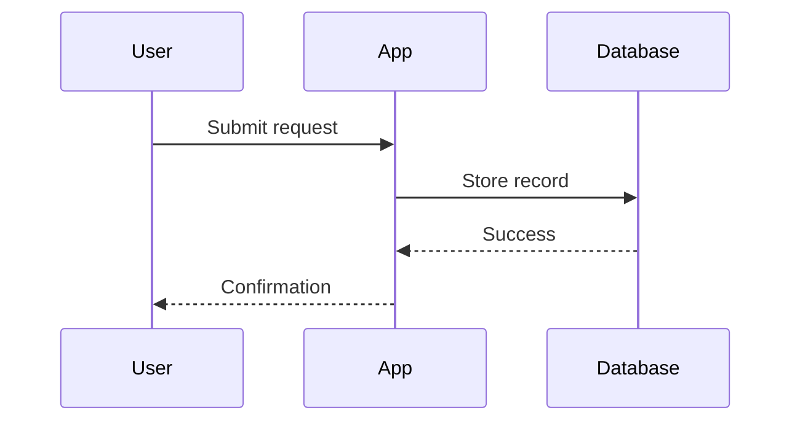
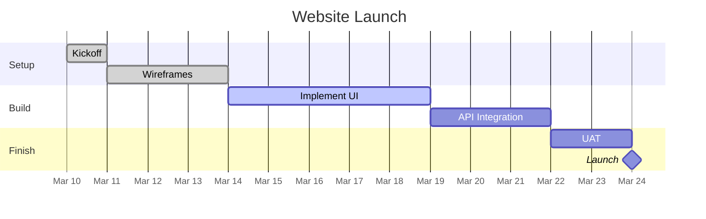
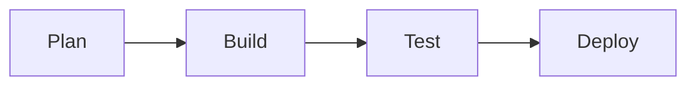

# Wysee MD — Feature Demo

This document demonstrates every major feature of the Wysee MD extension. Open it in VS Code or VSCodium with Wysee MD installed to see the WYSIWYG canvas in action.

---

## Getting started

When you open this file, it renders in the Wysee MD canvas automatically. Try these interactions:

- **Single-click** any block to select it (you'll see a blue outline)
- **Hover** over a block to see its bounds (dashed outline)
- **Double-click** any block to edit its raw Markdown in the inline editor
- Click the **(+)** button between blocks to insert new content
- Click **Source** in the title bar to open the raw Markdown side-by-side

> **Tip:** Toggle **Sync scroll** in the top bar to keep the canvas and source editor aligned as you navigate.

---

## 1. Text formatting

Wysee MD renders standard Markdown inline formatting:

This text is **bold**. This text is *italic*. This is ***bold italic***. This is `inline code`. And ~~this text is struck through~~.

> This is a blockquote. It can contain **bold**, *italic*, and `code`.
>
> It can also span multiple lines and include [links](https://example.com).

---

## 2. Lists

### Unordered list with nesting

Wysee MD renders nested lists with proper indentation — sub-items are visually indented proportional to their depth.

* Fruits
  * Apples
  * Bananas
    * Ripe
    * Green
  * Cherries
* Vegetables
  * Carrots
  * Peas

### Ordered list

Numbering is preserved from your source. If you write `3.` it renders as 3, not 1.

1. First step
2. Second step
3. Third step

### Task list

- [x] Write the draft
- [x] Add examples
- [ ] Review formatting
- [ ] Publish the final version

---

## 3. Tables

### Simple table

| Feature       | Supported | Notes                      |
| ------------- | --------- | -------------------------- |
| Headings      | Yes       | `#` through `######`       |
| Tables        | Yes       | Great for structured data  |
| Mermaid       | Yes       | Renders as live diagrams   |
| Math          | Yes       | Via KaTeX                  |
| Footnotes     | Yes       | Custom rendering system    |
| Strikethrough | Yes       | `~~text~~`                 |

### Table with alignment

| Left-aligned | Center-aligned | Right-aligned |
| :----------- | :------------: | ------------: |
| Row 1        | Data           |         $1.00 |
| Row 2        | Data           |        $12.50 |
| Row 3        | Data           |       $100.00 |

> **Tip:** Right-click anywhere in the canvas and use **Insert MD Block > Table MxN** to create tables up to 16 columns × 32 rows.

---

## 4. Code blocks with syntax highlighting

Fenced code blocks render with language-specific syntax highlighting. Token colors are controlled by the active syntax style — switch styles in the Style panel under "Code Syntax Highlighting".

The `wyseeMd.preview.syntaxHighlight` setting (enabled by default) is the master on/off switch. Individual languages can also be disabled per syntax style using `"highlight": false`.

```python
def fibonacci(n: int) -> list[int]:
    seq = [0, 1]
    while len(seq) < n:
        seq.append(seq[-1] + seq[-2])
    return seq[:n]

print(fibonacci(8))
```

```sql
SELECT users.name, COUNT(orders.id) AS order_count
FROM users
LEFT JOIN orders ON users.id = orders.user_id
GROUP BY users.name
HAVING order_count > 5
ORDER BY order_count DESC;
```

```javascript
const greet = (name) => {
  console.log(`Hello, ${name}!`);
  return { greeting: `Hello, ${name}!`, timestamp: Date.now() };
};
```

---

## 5. Mermaid diagrams

Wysee MD renders Mermaid fenced blocks as live, interactive diagrams — in the canvas, in print output, and in HTML exports.

### Flowchart



### Sequence diagram



### Gantt chart



---

## 6. Math (KaTeX)

Wysee MD renders math expressions via KaTeX — both inline and block.

Euler's identity: $e^{i\pi} + 1 = 0$. The quadratic formula: $x = \frac{-b \pm \sqrt{b^2 - 4ac}}{2a}$.

Block math:

$$
\int_0^1 x^2\,dx = \left[\frac{x^3}{3}\right]_0^1 = \frac{1}{3}
$$

Maxwell's first equation:

$$
\nabla \cdot \vec{E} = \frac{\rho}{\varepsilon_0}
$$

---

## 7. Footnotes

Wysee MD has a custom footnote system. References render as superscript numbers, and a footnote section appears at the end of the document.[^1]

Footnotes support numeric labels[^2] and are validated for consistency — you can't mix numbers and letters in the same document.

When you double-click this paragraph to edit it, the edit panel automatically includes the footnote definitions below the block content, so you can edit both the reference and the definition in one place.

[^1]: This is the first footnote. It appears in the "Footnotes" section at the bottom of the rendered document.
[^2]: Duplicate labels use the first definition. If you define `[^2]` twice, only the first one is used.

---

## 8. Images with attribute syntax

Wysee MD supports a `{width, align}` attribute syntax for images:

{width=25%, align=center}

The syntax is:

```md
{width=50%, align=left}
```

Supported attributes:

- `width` — any CSS width value (e.g., `50%`, `200px`, `100%`)
- `align` — `left`, `center`, or `right`

These attributes are preserved through editing and applied in print/PDF output.

---

## 9. Links

Here is a link to [Markdown Guide](https://www.markdownguide.org/). Wysee MD opens links externally when clicked in the canvas.

---

## 10. Print directives

Wysee MD supports comment directives that control page layout in print and PDF output. They don't affect the canvas view.

<!-- wysee:page-break -->

### After the page break

This content appears on a new page when printed or exported to PDF. The directive above forces a page break at that point.

Supported directives:

- `<!-- wysee:page-break -->` — force a page break here
- `<!-- wysee:page-break-before -->` — break before the next block
- `<!-- wysee:page-break-after -->` — break after the current block

---

## 11. Editing workflow

### The inline editor

Double-click any block in this document to open the inline editor. It appears in place of the block with:

- **Left half:** Raw Markdown textarea with line numbers
- **Right half:** Live preview that updates as you type

Press **Ctrl/Cmd+Enter** to confirm your edit, or **Escape** to cancel. The live preview renders with your current document style, including mermaid diagrams, math, and footnotes.

### Inserting new content

The **(+)** buttons between blocks open the same editor panel for inserting new content. The first **(+)** at the top of the document is always visible. Others appear when you hover over a block.

You can also right-click to use **Insert MD Block** with templates for headings, links, images, tables, code fences, mermaid fences, task lists, horizontal rules, quotes, and footnotes.

### Context menu behavior

The right-click **Insert MD Block** menu adapts to context:

- **On a block:** inserts before or after it (configurable via `wyseeMd.preview.insertRelativeToBlock`)
- **In empty space:** inserts between the nearest blocks
- **In a blank document:** creates the first block
- **In the edit panel textarea:** inserts the template at the cursor position

### Undo / Redo

**Ctrl+Z** and **Ctrl+Y** work throughout:

- In the canvas: undoes/redoes block insertions and edits
- In the edit panel: native undo/redo within the textarea

---

## 12. Copy behavior

Select text by dragging across blocks, then copy with **Ctrl+C**. The **(+)** buttons are automatically excluded from the clipboard.

The `wyseeMd.preview.copyMode` setting controls what gets copied:

- `plainText` (default) — clean rendered text, no Markdown syntax
- `sourceMarkdown` — raw Markdown source for the selected blocks

Cut and paste are restricted to the edit panel textarea to prevent accidental canvas modifications.

---

## 13. Scroll synchronization

Click **Sync scroll** in the top bar, then open the source editor with the **Source** button.

- Scroll the canvas → the source editor follows
- Scroll the source → the canvas follows
- Click a block in the canvas → source jumps to that line

The source editor opens at your current canvas position, not at the top of the file.

---

## 14. Theming, syntax styles, and print profiles

Open the style panel from **Style** in the title bar. It opens as a side panel so you can see changes live.

### Document styles

Control how Markdown elements look in the canvas and print output. Built-in styles:

- **Match Editor Theme** — inherits your VS Code color theme
- **Light** — clean light background
- **Dark** — dark background with light text

Create custom styles as JSON with element-level CSS declarations for headings, paragraphs, blockquotes, links, tables, code blocks, and more. A document style can link to a syntax style via the `syntaxStyle` field.

### Syntax styles

Control how code blocks are colored. Built-in syntax styles:

- **Match Editor Theme** — adapts to your VS Code color theme via CSS variables
- **Light** — GitHub-inspired light syntax colors
- **Dark** — One Dark-inspired dark syntax colors

Create custom syntax styles with token-level CSS (keyword, string, comment, function, etc.) and per-language overrides. Set `"highlight": false` globally or per language to disable coloring.

### Print profiles

Control page layout for print and PDF:

- Page size (Letter, A4, Legal, etc.) and orientation
- Margins (with optional mirror margins for two-sided printing)
- Page numbers (position, style, start number, first-page suppression)
- Code block wrapping
- Image default alignment and max width
- Link to a specific document style via the `printStyle` field

---

## 15. Spellcheck

Wysee MD provides integrated spellcheck in both the canvas and source editor. Misspelled words are underlined in red. Right-click a misspelled word for options:

- Add to user dictionary
- Add to workspace dictionary
- Ignore in this session
- Ignore in this document

Spellcheck skips code blocks, inline code, mermaid fences, URLs, and math expressions. Spell underlines are automatically stripped from print and PDF output.

---

## 16. Mixed content example

### Mini project summary

| Metric          | Value |
| --------------- | ----- |
| Tasks completed | 12    |
| Bugs fixed      | 7     |
| Build status    | Pass  |
| Coverage        | 91%   |

Scoring formula: $\text{score} = 0.5x + 0.3y + 0.2z$

Workflow:



---

## Final note

This document covers the major features of Wysee MD. For the full settings reference and additional documentation, see the [README](https://github.com/grainpool/wysee-md#readme) or open VS Code Settings and search for "Wysee MD".
