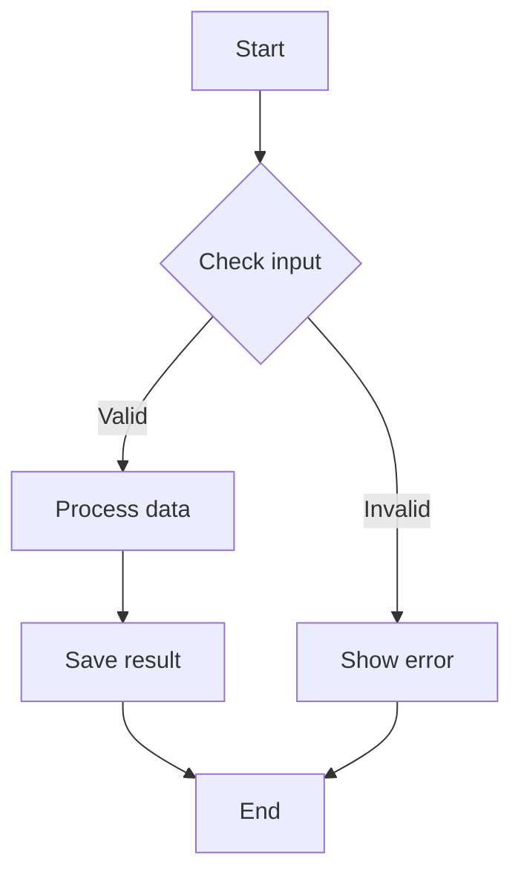
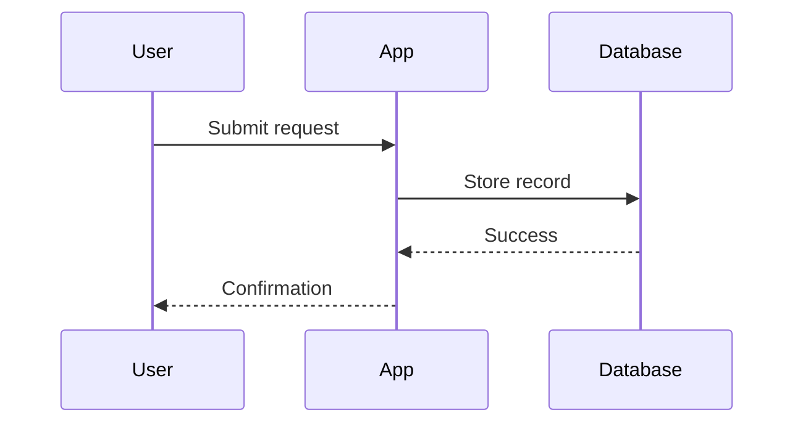

# Wysee Markdown — Feature Demo

This document demonstrates the major features of Wysee Markdown. Open it in VS Code or VSCodium with the extension installed to see the WYSIWYG canvas in action.

📖 [Full documentation](https://docs.grainpoolholdings.com/open-source-projects/wysee.html)

---

## Getting started

When you open this file, it renders in the Wysee canvas automatically. Try these interactions:

- **Single-click** any block to select it (blue outline)
- **Hover** over a block to see its bounds (dashed outline)
- **Double-click** any block to edit its raw Markdown in the inline editor
- Click the **(+)** button between blocks to insert new content
- Click **Export options…** in the bottom bar for print, PDF, and export actions
- Toggle **Sync scroll** to keep the canvas and source editor aligned

> **Tip:** If a Markdown file opens in the text editor instead, right-click it in the Explorer or its tab and choose **Open with Wysee**.

---

## 1. Text formatting

This text is **bold**. This text is *italic*. This is ***bold italic***. This is `inline code`. And ~~this text is struck through~~.

> This is a blockquote. It can contain **bold**, *italic*, and `code`.
>
> It can also span multiple lines and include [links](https://example.com).

---

## 2. Lists

### Unordered list with nesting

* Fruits
  * Apples
  * Bananas
    * Ripe
    * Green
  * Cherries
* Vegetables
  * Carrots
  * Peas

### Ordered list

1. First step
2. Second step
3. Third step

### Task list

- [x] Write the draft
- [x] Add examples
- [ ] Review formatting
- [ ] Publish the final version

---

## 3. Tables

| Feature              | Supported | Notes                         |
| -------------------- | --------- | ----------------------------- |
| Headings             | Yes       | `#` through `######`          |
| Tables               | Yes       | Up to 16×32 via context menu  |
| Mermaid              | Yes       | Renders as live diagrams      |
| Math                 | Yes       | Via KaTeX                     |
| Footnotes            | Yes       | Custom rendering system       |
| Approval Matrix      | Yes       | XLSX + HTML review bundle     |
| AI Summaries         | Yes       | Optional, YAML-configured     |

| Left-aligned | Center-aligned | Right-aligned |
| :----------- | :------------: | ------------: |
| Row 1        | Data           |         $1.00 |
| Row 2        | Data           |        $12.50 |
| Row 3        | Data           |       $100.00 |

---

## 4. Code blocks with syntax highlighting

```python
def fibonacci(n: int) -> list[int]:
    seq = [0, 1]
    while len(seq) < n:
        seq.append(seq[-1] + seq[-2])
    return seq[:n]

print(fibonacci(8))
```

```sql
SELECT users.name, COUNT(orders.id) AS order_count
FROM users
LEFT JOIN orders ON users.id = orders.user_id
GROUP BY users.name
HAVING order_count > 5
ORDER BY order_count DESC;
```

```javascript
const greet = (name) => {
  console.log(`Hello, ${name}!`);
  return { greeting: `Hello, ${name}!`, timestamp: Date.now() };
};
```

---

## 5. Mermaid diagrams

### Flowchart



### Sequence diagram



---

## 6. Math (KaTeX)

Euler's identity: $e^{i\pi} + 1 = 0$. The quadratic formula: $x = \frac{-b \pm \sqrt{b^2 - 4ac}}{2a}$.

$$
\int_0^1 x^2\,dx = \left[\frac{x^3}{3}\right]_0^1 = \frac{1}{3}
$$

---

## 7. Footnotes

Wysee has a custom footnote system. References render as superscript numbers.[^1] Edit footnote text directly from the referencing block's edit panel.[^2]

[^1]: This is the first footnote. It appears in the "Footnotes" section at the bottom.
[^2]: Double-click this paragraph to edit both the text and the footnote definitions together.

---

## 8. Images with attribute syntax

{width=25%, align=center}

```md
{width=50%, align=left}
```

---

## 9. Print directives

<!-- wysee:page-break -->

### After the page break

This content appears on a new page when printed or exported to PDF.

- `<!-- wysee:page-break -->` — force a page break here
- `<!-- wysee:page-break-before -->` — break before the next block
- `<!-- wysee:page-break-after -->` — break after the current block

---

## 10. Exporting an approval matrix

The approval matrix export produces a ZIP bundle containing a styled XLSX spreadsheet and a self-contained review HTML page. Every changed region (hunk) becomes one row with rendered before/after card images.

### Try it with this demo file

1. **Make some changes** — Edit a few sections of this demo file. Change a heading, add a paragraph, modify a table row, or delete a code block. Save the file.

2. **Open the export dialog** — Click **Export options…** in the bottom bar, then **Export Approval Matrix…**. Or use the command palette: `Wysee: Export Approval Matrix`.

3. **Choose a comparison** — The QuickPick shows:
   - ⚡ **Working tree diff** — compares your saved changes against the last commit (one click)
   - Recent commits — pick one, then pick what to compare it against (two clicks)
   - **Enter manually** — paste two commit hashes as `abc1234, def5678`

4. **Enter a publish URL** (or leave blank for relative links) and choose where to save the ZIP.

5. **Open the bundle** — Unzip to find:
   - `demo-approval-matrix.xlsx` — the workbook with one row per hunk
   - `demo-review.html` — open in a browser for a side-by-side rendered diff

6. **Review the workbook** — Each row has:
   - **Change No.** — sequential identifier
   - **Doc path** — file path with section context
   - **Summary** — blank by default, or AI-generated if configured
   - **Previous Version / Change** — rendered card images showing before/after
   - **Link to Doc** — hyperlink to the matching hunk in the review HTML
   - **Approval** — dropdown (Pending, Approved, Needs changes, Not applicable)
   - **Comments** — free text

### Comparing specific commits

To compare two specific versions of this file without editing it:

1. Open this file in Wysee
2. Run **Export Approval Matrix…**
3. Select a commit from the list (e.g. `ab98105`)
4. Select what to compare against (e.g. `current-changes` or another commit)
5. Export and review the bundle

### Adding AI summaries

1. Run **Wysee: AI Config: Open ai-config.yaml** from the command palette (or click **Configure AI…** in the export popup)
2. Uncomment and configure a model entry — for a local Ollama model:
   ```yaml
   models:
     - name: Qwen3-Coder 30B
       provider: ollama
       model: qwen3-coder:30b
       endpoint: http://localhost:11434/v1
       auth: none
   activeModel: "Qwen3-Coder 30B"
   ```
3. Run the export again — after choosing the comparison, a second QuickPick asks which model to use
4. Summaries appear in column C of the workbook

---

## 11. Theming and print profiles

Open **Export options… → Print…** or use the **Style** button to switch document styles, syntax styles, and print profiles. Create custom styles as JSON with element-level CSS.

### Built-in document styles

- **Match Editor Theme** — inherits your VS Code color theme
- **Light** — clean light background
- **Dark** — dark background with light text

### Built-in syntax styles

- **Match Editor Theme** — adapts via CSS variables
- **Light** — GitHub-inspired
- **Dark** — One Dark-inspired

---

## 12. Spellcheck

Misspelled words show a red wavy underline. Right-click for options: add to dictionary, ignore in session, or ignore in document. Spellcheck skips code blocks, URLs, and math expressions. Underlines are stripped from print output.

---

## Final note

For the full settings reference and additional documentation, visit the [product docs](https://docs.grainpoolholdings.com/open-source-projects/wysee.html) or open VS Code Settings and search for "Wysee".
